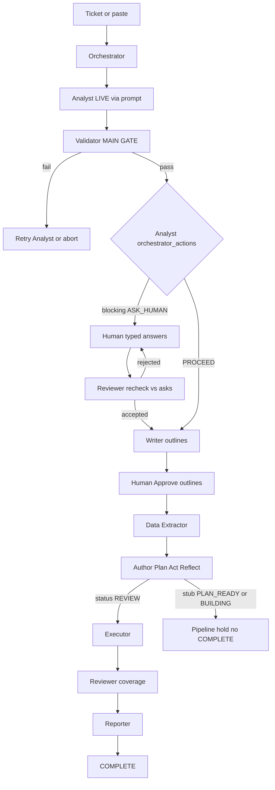

# QA Agent Farm

Browser-based QA planning simulator with a multi-agent pipeline, JIRA live fetch, and requirements paste mode. Agent 1 (Requirement Analyst) runs live via the Cursor Agent CLI.

Inspired by mabl-style **Plan → Approve → Author (Plan→Act→Reflect)** — without cloning proprietary auto-heal. The farm owns its own durable gates, honest terminal states, and evidence-based execution.

## Target pipeline

```text
Analyst → (human gate) → Writer(outlines) → (approve) → Data Extractor → Author → Executor → Reviewer → Reporter
                                                              │
                                                              └─ always runs; source = human curl/URL or story context
```



| Agent | Role |
|-------|------|
| **Orchestrator** | Only entry point; assigns workers; **executes Analyst actions** (does not invent readiness) |
| **Analyst** | **Readiness main gate** — ACs, gaps, prereqs, `orchestrator_actions` via prompt |
| **Writer** | Emits `test_outlines` (primary) + GWT docs; human Approve/Reject before Author |
| **Data Extractor** | Always runs; builds datasets / oracles from human input or story context |
| **Author** | Builds executable steps from **approved** outlines (Playwright stub — cannot COMPLETE yet) |
| **Executor** | Transport / evidence observation (honest HTTP / pending browser) |
| **Reviewer** | Coverage + evidence review; also **rechecks human input vs Analyst asks** |
| **Reporter** | SEHA-style summary from real artifacts |

`Writer` stops treating offline Given/When/Then as the primary unblock for Author. Outlines + human approval do. Legacy GWT may remain as documentation only.

Trigger a run with `qa:`, `test:`, `ticket:`, or “write tests for” / “review this ticket”. Worker subagents run **only** when the orchestrator dispatches them.

## `.cursor/` folder (keep it)

Cursor IDE dispatch config — **not** the simulator runtime. Code changes live under `agents/`, `src/prompts/`, `js/`. `.cursor/` rarely changes when you edit the Analyst prompt (the skill only *points* at the prompt file).

| Path | Purpose |
|------|---------|
| `.cursor/agents/*.md` | Subagent entrypoints Cursor can dispatch (`qa-orchestrator`, `qa-analyst`, …) |
| `.cursor/skills/qa-*/SKILL.md` | Per-role rules for those subagents |
| `.cursorrules` | Triggers (`qa:` / `test:` / `ticket:`) + “orchestrator-only dispatch” |

**Do not remove.** Without it, Cursor chat cannot run the farm as subagents. Simulator-only users still need it if they use `qa:` in Cursor.

Analyst rules stay in **one place:** `src/prompts/agent1_requirement_analyst_v3.md` — `.cursor/skills/qa-analyst` is a pointer only.

## Hard gates (P0)

**Analyst prompt + Validator is the readiness gate.** The orchestrator only executes `analyst_report.orchestrator_actions` — it does not invent HOLD/ASK or a second readiness story.

### 1. Zero-AC kill switch

```text
IF validated testable_conditions.length === 0:
  pipeline_state = NEEDS_INPUT
  ask human for testable acceptance criteria / clarified intent
  FORBID: placeholder TC-01, Writer, Author, run_end(success)
```

Regression: `test/zero-ac-gate.js`.

### 2. Prerequisites cannot bypass empty ACs

`submitPrerequisites()` may only unlock Writer when:

```text
testable_conditions.length > 0
AND missing_blocking_prereqs.length === 0
AND Reviewer human-input recheck = accepted
```

### 3. Human-input recheck (Reviewer)

After the human submits prerequisites:

1. Reviewer maps each answer to Analyst blocking asks / `ASK_HUMAN`
2. **Blames** mismatches (empty, placeholder, wrong shape: URL / curl / credentials)
3. Verdict:
   - `accepted` → unlock Writer / Author path
   - `rejected` → stay on human gate until corrected

Regression: `test/human-input-recheck.js`.

### 4. Upstream validated-output dependency

```text
Agent N may start ONLY IF Agent N-1 has:
  1) structured output in storyOutputs, AND
  2) Validator approve (orchestrator_gate)
```

Writer+ phases are not pre-built while human gates are open; they append after unlock. Blocked Author → pipeline hold (no Executor).

Regression: `test/dependency-gate.js`.

### 5. Honest terminal states

| State | Meaning |
|-------|---------|
| `NEEDS_INPUT` | Missing ACs / credentials / URL / blocked step |
| `PLAN_READY` | Outline awaiting human approval |
| `BUILDING` | Author session running |
| `REVIEW` | Executable test built + verified |
| `FAILED` | Author exhausted retries / invalid requirements |
| `COMPLETE` | Only after REVIEW + Reporter |

`run_end` success only if `status === COMPLETE`. Timeline exhaustion alone is **not** success.

## Author agent (chosen: dedicated `qa-author`)

**Decision:** Option **B** — new `qa-author` between Writer and Reviewer (cleaner role split than upgrading Executor).

### Input

```text
approved outline + env URL + credentials + (optional) curl/API contract
```

### Loop per task/step

```text
PLAN    → next action from outline + last screenshot/DOM
ACT     → Playwright click/type/navigate (or API call)
REFLECT → assert validation; capture screenshot/console/network
if fail → undo/retry once with alternate locator/strategy
if still fail → NEEDS_INPUT (never invent pass)
replay prefix steps before advancing (stability check)
```

Author is **scaffolded** (`agents/author.js`, `.cursor/skills/qa-author/`) — refuses empty ACs / unapproved outlines; Playwright MVP is Sprint S2.

## Writer outline contract (S1)

Primary Writer artifact:

```json
{
  "test_outlines": [
    {
      "id": "TO-01",
      "title": "…",
      "mapped_acs": ["AC-1"],
      "intent": "…",
      "preconditions": [],
      "tasks": [{ "id": "T1", "action": "…", "validation": "…" }],
      "status": "draft"
    }
  ],
  "coverage_matrix": { "AC-1": ["TO-01"] }
}
```

Rules:

- One outline per distinct intent (happy / negative / exception)
- Every AC ID in `coverage_matrix` or explicitly `not_testable` with reason
- Human gate: Approve / Edit / Reject — only `approved` outlines enter Author

## Delivery status

| Sprint | Deliverable | Status |
|--------|-------------|--------|
| **S0** | Zero-AC gate + no placeholder TC + no success without ACs | Done |
| **S0+** | Reviewer human-input recheck vs Analyst (blame + accept/reject) | Done |
| **S0+** | `qa-author` scaffold in pipeline | Done (stub) |
| **S0+** | Upstream validated-output dependency gate | Done |
| **S1** | Writer emits `test_outlines` + approval UI | Done |
| **S1+** | Stub/LIVE runner badges + honest Author COMPLETE block messaging | Done |
| **S2** | Author MVP (Playwright) for 1 happy-path outline | Planned |
| **S3** | Persist run state + rehydrate simulator | Planned |
| **S4** | Failure classification + recovery proposals | Planned |

### Explicit non-goals (for now)

- Don’t clone mabl visual auto-heal
- Don’t require cloud MCP
- Don’t delete GWT entirely — demote it to documentation
- Don’t let Author “fix” product code

## Model routing

| Role | Model ID |
|------|----------|
| Orchestrator | `claude-fable-5` (Claude Fable 5) |
| Validator + all worker agents | `claude-4.6-sonnet` (Claude Sonnet) |

Configured in `agents/registry.js` (`AGENT_MODEL_ROUTING`) and `.cursor/agents/*.md`.

## Requirements

- **Node.js >= 18.18** with `"type": "module"` in `package.json`
- Browser classic scripts (`lib/prerequisites.js`, samples) stay CJS-compatible; Node loads `lib/prerequisites.cjs` via `createRequire`
- Optional: JIRA credentials in `.env` for live ticket fetch
- For Cursor agent runs: enable **Claude Fable 5** and **Claude Sonnet** in Cursor Models settings

## Honest execution semantics (v0.3)

- Pipeline agent/validator loop is a **simulated** orchestrator (`orchestration_mode: simulated_pipeline`)
- `/api/execute` performs a **transport-only** HTTP call — HTTP 2xx is `transport_observed`, **not** a per-AC pass
- Webpage URLs are `pending_browser` until real browser evidence exists
- Secrets in curl/JSON (`api_key`, `access_token`, `password`, …) are redacted in UI/logs/exports
- NCA/ECC security gaps (injection, IDOR, URL manipulation, API exposure, auth bypass) block release when applicable
- Executor deny-by-default: no loopback, redirect re-allowlisted, rate limit + local/token auth + audit log

## Quick start

```bash
cp .env.example .env   # optional — fill JIRA credentials
npm run doctor
npm start
```

Open http://127.0.0.1:5173/simulator.html

## Scripts

| Command | Purpose |
|---------|---------|
| `npm start` | Run local server on port 5173 |
| `npm test` | Requirements, eval fixes, agent1, zero-AC gate, human-input recheck |
| `npm run test:zero-ac` | Zero-AC hard gate only |
| `npm run test:human-recheck` | Reviewer human-input recheck only |
| `npm run doctor` | Check Node version, files, and module health |
| `npm run check:modules` | Verify all production ES modules parse |

## Configuration

| Variable | Description |
|----------|-------------|
| `JIRA_URL` | JIRA base URL |
| `JIRA_USERNAME` | JIRA user email |
| `JIRA_API_TOKEN` | JIRA API token |
| `EXECUTOR_ALLOWLIST` | Comma-separated hosts allowed for `/api/execute` (default: localhost only) |
| `PORT` | Server port (default `5173`) |

## Security notes

- Static file serving uses an **allowlist** — dotfiles (`.env`, `.git`) are blocked
- JIRA API responses use **same-origin CORS** only (no wildcard)
- Curl **Authorization** values are **redacted** in UI, logs, and exports
- API execution is limited to **allowlisted hosts** via `EXECUTOR_ALLOWLIST`

## Project layout

```
agents/            # Pipeline agents (orchestrator, analyst, writer, author, …)
lib/               # Requirements parser, human-input, redaction, executor
js/                # Browser simulator entry
.cursor/skills/    # Per-agent qa-*/SKILL.md for Cursor
src/prompts/       # Agent 1 (Requirement Analyst) prompt — single source of truth
simulator.html     # UI shell
server.js          # Local dev server + JIRA proxy + execution endpoint
test/              # Gate + agent regression tests
```

## Evaluation fixes (v0.2.0)

Addresses enterprise evaluation findings:

- **EVAL-001** — Module parse errors fixed; CI module checks added
- **EVAL-002** — Executor records HTTP evidence via `/api/execute`
- **EVAL-003** — Improved AC classification (auth rules, time limits, data tables)
- **EVAL-004** — Both API and UI surfaces routed when detected
- **EVAL-005** — Curl parser supports `--request` / `--header`; secrets redacted
- **EVAL-006** — Server hardening (allowlist, CORS, limits, security headers)
- **EVAL-007** — Fallback metrics are null until measured

## License

Private / unlicensed — internal use.
