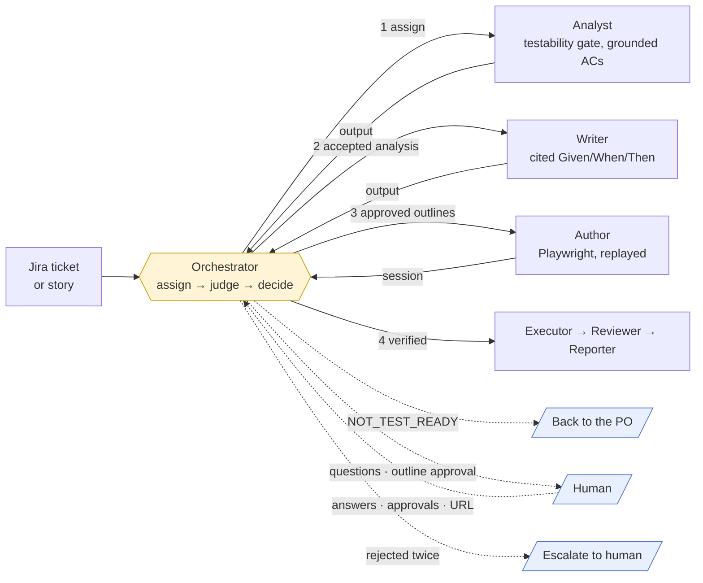

# QA Agent Farm

A multi-agent QA pipeline that turns a Jira story (or pasted requirements) into **grounded, traceable test cases**, and optionally verifies them in a real browser. Each agent's output passes a validation gate. A human confirms anything the agents can't prove, and no run claims a pass without evidence.

## How it works


```mermaid
flowchart LR
  S[Jira ticket<br/>or story] --> O
  O{{"Orchestrator<br/>assign → judge → decide"}}

  O -- "1 assign" --> AN["Analyst<br/>testability gate, grounded ACs"]
  AN -- output --> O
  O -- "2 accepted analysis" --> WR["Writer<br/>cited Given/When/Then"]
  WR -- output --> O
  O -- "3 approved outlines" --> AU["Author<br/>Playwright, replayed"]
  AU -- session --> O
  O -- "4 verified" --> EX["Executor → Reviewer → Reporter"]

  O -. "NOT_TEST_READY" .-> PO[/Back to the PO/]
  O -. "questions · outline approval" .-> H[/Human/]
  H -. "answers · approvals · URL" .-> O
  O -. "rejected twice" .-> ESC[/Escalate to human/]

  classDef brain fill:#fff4d6,stroke:#c99a06;
  classDef human fill:#e8f0fe,stroke:#4a6fd1;
  class O brain;
  class PO,H,ESC human;
```

### The orchestrator is the brain

No agent talks to another. For every agent, the orchestrator follows the same loop:

1. It assigns the agent, giving it the output it accepted from the previous agent.
2. It judges the result.
3. It decides: proceed, retry once with its reasons, ask a human, hold, or escalate.

Only accepted output is handed to the next agent, and every decision is recorded on the run (`src/agents/orchestratorRun.js`).

### Three rules hold everywhere

- **Grounding.** Every acceptance criterion, risk and test case quotes the story word for word, or code drops it.
- **Code decides, not the model.** Scores, priorities, citations, browser assertions and gates are checked in code.
- **Honest states.** A run is `COMPLETE` only after a verified, replayed Author session and the Reporter.

## The agents

| Agent | Does | Live in simulator |
|---|---|---|
| Orchestrator | The brain: assigns every agent, judges its output, and decides whether it moves on | ✅ judges in code |
| Analyst | Testability gate, then grounded ACs, risk and test-gap passes | ✅ LLM |
| Validator | Second-opinion gate on every output | deterministic |
| Writer | One Given/When/Then case per checklist line, with a verbatim citation | ✅ LLM |
| Data Extractor | Valid, invalid and boundary datasets | deterministic |
| Author | Runs an approved outline in a browser and replays it | ✅ LLM + Playwright |
| Executor, Reviewer, Reporter | Execution evidence, coverage review, SEHA-style report | deterministic |

## Quick start

Requires **Node.js 18.18 or later**.

```bash
cp .env.example .env
```

```bash
npm start
```

Open <http://127.0.0.1:5173/simulator.html>. Pick the LLM runner at `/settings.html`: the Cursor CLI, Anthropic, OpenAI, OpenRouter, or any OpenAI-compatible endpoint.

**In Claude Code,** type `qa: PROJ-123` (or `test:` / `ticket:`). `CLAUDE.md` hands the run to `qa-orchestrator`, which dispatches the subagents.

**Optional live Author:**

```bash
npm i -D playwright && npx playwright install chromium
```

## Testing

```bash
npm test
```

That runs the full offline suite, including the end-to-end golden run from story to report.

```bash
npm run eval:golden-trend
```

That runs the golden stories against a real model and checks the trend for regressions. It also runs weekly in CI.

## Project layout

```text
.claude/agents, .claude/skills   Agent entry points + rules (the single source of truth)
src/agents/                      Live Analyst, Writer, Author (+ grounding, skill checks)
agents/                          Pipeline: orchestrator, validator, gates, deterministic agents
lib/  js/                        Shared logic, browser simulator (+ run save/resume)
server.js                        Local server: Jira proxy, live agents, guarded execution
test/                            Regression, e2e and golden tests
docs/REFERENCE.md                Gates, config, env vars, HTTP API, all commands, changelog
```

See **[docs/REFERENCE.md](docs/REFERENCE.md)** for everything else.

Private, for internal use.
