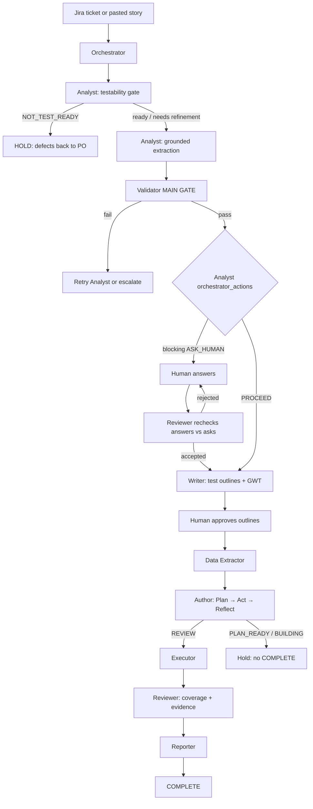

# QA Agent Farm

A multi-agent QA pipeline that turns a Jira story (or pasted requirements) into **grounded, traceable test cases**. Each step passes through a validation gate, a human confirms anything the agents can't prove, and runs end in terminal states that never claim a pass without evidence.

It runs in two ways:

- **Claude Code pipeline.** Type `qa: <ticket>` and the orchestrator dispatches the Analyst, Writer and other agents as subagents.
- **Browser simulator.** A local web UI (`simulator.html`) that runs the same pipeline. The Analyst and Writer can run live behind a pluggable LLM runner, and the Author can run live in a real browser (Playwright). Runs are saved locally and can be resumed after a reload.

The design follows mabl's **Plan → Approve → Author (Plan → Act → Reflect)** workflow, without copying its proprietary auto-heal. The farm has its own gates and grounding.

---

## Contents

- [Quick start](#quick-start)
- [How a run works](#how-a-run-works)
- [The agents](#the-agents)
- [Requirement Analyst](#requirement-analyst)
- [Hard gates](#hard-gates)
- [Writer and Author contracts](#writer-and-author-contracts)
- [Execution and security](#execution-and-security)
- [Configuration](#configuration)
- [HTTP API](#http-api)
- [Testing](#testing)
- [Project layout](#project-layout)
- [Roadmap](#roadmap)
- [Changelog](#changelog)

---

## Quick start

**Requires Node.js 18.18 or later.**

```bash
cp .env.example .env
```

Optional: fill in your Jira credentials and an LLM runner in `.env`.

```bash
npm run doctor
```

```bash
npm start
```

Then open <http://127.0.0.1:5173/simulator.html>. Choose the Analyst's LLM provider at <http://127.0.0.1:5173/settings.html>; that's optional, and the default runner is the Cursor Agent CLI.

**From Claude Code,** open the repo and type:

```text
qa: PROJ-123
```

`CLAUDE.md` routes the message to `qa-orchestrator`, which runs the pipeline. Worker agents only run when the orchestrator dispatches them, so if you invoke one directly it declines.

Other triggers: `test:`, `ticket:`, "write tests for…", "review this ticket".

---

## How a run works


```mermaid
flowchart TD
  start[Jira ticket or pasted story] --> orch[Orchestrator]
  orch --> gate[Analyst: testability gate]
  gate -->|NOT_TEST_READY| po[HOLD: defects back to PO]
  gate -->|ready / needs refinement| analyst[Analyst: grounded extraction]
  analyst --> valA[Validator MAIN GATE]
  valA -->|fail| retryA[Retry Analyst or escalate]
  valA -->|pass| actions{Analyst orchestrator_actions}
  actions -->|blocking ASK_HUMAN| human[Human answers]
  human --> recheck[Reviewer rechecks answers vs asks]
  recheck -->|rejected| human
  recheck -->|accepted| writer
  actions -->|PROCEED| writer[Writer: test outlines + GWT]
  writer --> approve[Human approves outlines]
  approve --> data[Data Extractor]
  data --> author[Author: Plan → Act → Reflect]
  author -->|REVIEW| exec[Executor]
  author -->|PLAN_READY / BUILDING| hold[Hold: no COMPLETE]
  exec --> rev[Reviewer: coverage + evidence]
  rev --> rep[Reporter]
  rep --> done[COMPLETE]
```

**Primary path:** Analyst produces a requirements breakdown, then the Writer produces test cases.

**Optional execution phase:** Data Extractor → Author → Executor → Reviewer → Reporter.

No agent starts until the agent before it has returned structured output **and** the Validator has approved it.

---

## The agents

| Agent | Level | Role | Rules |
|---|---|---|---|
| **Orchestrator** | L1 | Only entry point. Dispatches workers and carries out the Analyst's validated actions; it never decides readiness itself | `qa-orchestrator` |
| **Validator** | L2 | Second-opinion gate on every worker output | `qa-validator` |
| **Requirement Analyst** | L2 | Testability gate, then the grounded requirements breakdown and atomic checklist | `qa-analyst` |
| **Writer** | L3 | Test outlines (primary) plus Given/When/Then cases, mapped one-to-one to the checklist. Live in the simulator after a live Analyst | `qa-writer` |
| **Data Extractor** | L3 | Valid, invalid and boundary datasets and a test oracle per case | `qa-data-extractor` |
| **Author** | L3 | Executable steps from *approved* outlines (Plan → Act → Reflect), run live with Playwright | `qa-author` |
| **Executor** | L3 | Runs the plan and records honest evidence | `qa-executor` |
| **Reviewer** | L4 | Scores coverage, checks human input against the Analyst's asks, investigates root causes | `qa-reviewer` |
| **Reporter** | L5 | SEHA-style test summary report (DOCX + JSON) | `qa-reporter` |

Each agent's entry point is `.claude/agents/<name>.md` and its rules are in `.claude/skills/<name>/SKILL.md`. Don't delete `.claude/`, because Claude Code needs it to run the farm.

### Model routing

| Role | Simulator / Cursor (`agents/registry.js`) | Claude Code (`.claude/agents/*.md`) |
|---|---|---|
| Orchestrator | `claude-fable-5` | `claude-fable-5` |
| Validator + workers | `claude-4.6-sonnet` | `claude-sonnet-5` |

---

## Requirement Analyst

The Analyst writes `test-artifacts/<ISSUE_ID>-requirements.md`, using the layout in `.claude/skills/qa-analyst/template.md`. The breakdown contains:

- a testability score and gate verdict;
- the flows and rules: AF, EF, BR, MSG (EN and AR) and DM;
- API scope and UI scope;
- Analyst Reasoning;
- an **Atomic Requirements Checklist**, which the Writer must cover one-to-one.

### Analysis passes

The Claude Code subagent and the simulator's JS Analyst (`src/agents/requirementAnalyst.js`) run the **same skill files**. Each skill runs as its own isolated pass, so the model has one narrow job at a time.

| # | Skill | Runs | Produces |
|---|---|---|---|
| 1 | `testability_analysis` | always, **the gate** | ISTQB CTAL-TA criteria judgments; score and verdict computed in code |
| 2 | `requirements_analysis` | always | Grounded acceptance criteria plus per-criterion conflicts |
| 3 | `risk_analysis` | always (advisory) | Likelihood × impact, turned into `P0`–`P3` in code |
| 4 | `test_gap_analysis` | always (advisory) | Test conditions per element and test-design technique |
| 5 | `source_analysis` | only when a diff is present | Changed surfaces and regression areas |
| — | `root_cause_analysis` | failure investigations (Reviewer) | 5-Whys chain with each step labelled evidenced or hypothesis |

Skills live in `.claude/skills/qa-analyst/analysis/`; root-cause analysis lives in `qa-reviewer/analysis/`. `analysis/COMMON.md` holds the rules every pass shares (grounding, status, confidence, untrusted input), and the loader adds it to each skill. Each `SKILL.md` therefore describes only its own job.

### What the code enforces (the model doesn't grade itself)

- **Grounding** (`src/agents/grounding.js`). Every finding's quote must appear word for word in the story, or the finding is dropped. Findings taken from an image or PDF are kept only when attachments were actually sent, and they're marked provisional until a human confirms them.
- **Skill rules** (`src/agents/skillChecks.js`):
  - testability scoring and the gate;
  - rejecting risk lists that rate everything high×high;
  - rejecting gap lists that use a single technique;
  - dropping root causes that have no evidenced step.

  Any violation forces human review.
- **No invented priority.** If likelihood or impact is unknown, the line gets no risk value rather than a default one.
- **Conflicts.** Contradictory statements hold back only the criterion they affect, and the PO is asked for a decision.
- **Security context.** Login, session and API stories get the NCA ECC failure modes (`lib/nca-controls.js`) as prompts for the risk pass. Each risk still needs a quote from the story.

### Checklist line types

| Tag | Based on | Example |
|---|---|---|
| *(none)* | A verbatim story quote | `1. [AF03] Session is terminated — Reason: … — Risk: P0` |
| `[Provisional]` | A safe default for an open question | `… — Assumption: status value not stated (pending PO)` |
| `[Standing]` | A farm rule | `[UI][Standing] UI is designed properly` |

### Jira review mode

`jira-review.md` reviews a story for the Testing Team. It scores the story against the testability rubric and writes plain-text improvement suggestions. It can then post them as a Jira comment, but **only after a human approves**.

---

## Hard gates

The Analyst owns readiness (the MAIN GATE). The Validator re-checks the same contract, and the Writer, Author and Reviewer refuse output that isn't ready. The Orchestrator only carries out **validated** actions.

### 0. Testability gate (first pass)

```text
score = Σ weight × (met 1 | partial 0.5 | not_met 0)        # computed in code
75–100 → TEST_READY         proceed
51–74  → NEEDS_REFINEMENT   proceed; defects carried forward; confidence ≤ medium
0–50   → NOT_TEST_READY     HOLD: extraction skipped, defects returned to the PO
US-3 (testable AC) or T-2 (measurable) not_met → NOT_TEST_READY, whatever the score
```

A blocking verdict always needs human confirmation.

### 1. Zero-AC kill switch

```text
IF validated testable_conditions.length === 0:
  pipeline_state = NEEDS_INPUT
  ask the human for testable acceptance criteria
  FORBID: placeholder TC-01, Writer, Author, run_end(success)
```

### 2. Prerequisites can't bypass empty ACs

The Writer unlocks only when there's at least one testable condition, no blocking prerequisites are missing, **and** the Reviewer's recheck of the human input has passed.

### 3. Human-input recheck (Reviewer)

The Reviewer matches each human answer to the Analyst's blocking asks. It flags empty, placeholder or wrongly shaped answers (URL, curl, credentials) and returns `accepted`, which unlocks the Writer, or `rejected`, which keeps the run at the human gate.

### 4. Upstream validated-output dependency

Agent N starts only after agent N−1 has produced structured output **and** the Validator has approved it. A blocked Author puts the pipeline on hold and the Executor doesn't run.

### 5. Honest terminal states

| State | Meaning |
|---|---|
| `NEEDS_INPUT` | Missing ACs, credentials or URL, or a blocked step |
| `PLAN_READY` | Outline awaiting human approval |
| `BUILDING` | Author session running |
| `REVIEW` | Executable test built and verified |
| `FAILED` | Author ran out of retries, or the requirements are invalid |
| `COMPLETE` | Only after REVIEW and the Reporter |

`run_end` reports success only when the state is `COMPLETE`. Running out of time on the timeline is **not** success.

---

## Writer and Author contracts

### Writer outlines

```json
{
  "test_outlines": [{
    "id": "TO-01", "title": "…", "mapped_acs": ["AC-1"], "intent": "…",
    "preconditions": [], "tasks": [{ "id": "T1", "action": "…", "validation": "…" }],
    "status": "draft"
  }],
  "coverage_matrix": { "AC-1": ["TO-01"] }
}
```

- One outline per distinct intent (happy path, negative, exception).
- Every AC appears in `coverage_matrix`, or is marked `not_testable` with a reason.
- A human approves, edits or rejects each outline. Only `approved` outlines reach the Author.
- Given/When/Then cases stay as documentation; the outlines are what unblock the Author.

### Live Writer

After a live Analyst run, the simulator runs the Writer through the same LLM runner (`src/agents/testWriter.js`, driven by `qa-writer/SKILL.md`). Code checks the model's cases before they're used:

- A case for an AC the Analyst never produced is dropped.
- A case whose citation isn't verbatim from its AC is dropped.
- Risk is copied from the Analyst; the model can't re-rate it.
- Provisional ACs give `[Provisional]` cases.
- Every AC gets an explicit verdict.

Turn it off with `?writer=local`.

### Live Author (Playwright)

Approve an outline, give the target URL, then choose **Run live Author** in the Author tab. The loop is in `src/agents/liveAuthor.js`:

```text
PLAN    → the LLM proposes the next action from the task and a page snapshot
ACT     → Playwright clicks / fills / presses; on failure, the planner tries an alternate
REFLECT → the LLM names an assertion; CODE checks it against the page (the model's "done" is not a pass)
REPLAY  → every verified step is replayed from a fresh page; only a stable replay reaches REVIEW
```

- The browser stays on the target origin.
- Credentials reach the browser only. The planner sees `{{username}}` / `{{password}}`.
- A REVIEW result rebuilds the pipeline from data extraction, which unlocks Executor → Reviewer → Reporter.

Playwright is optional:

```bash
npm i -D playwright && npx playwright install chromium
```

Without it, the Author reports `NEEDS_INPUT` with that instruction.

### Resuming a run

The simulator saves each run to `localStorage` (`js/run-persistence.js`). The saved run includes:

- the story, with its live Analyst, Writer and Author results;
- outline approvals;
- the target URL;
- the current step.

After a reload, **Resume** restores the run without calling the models again. API secrets, credentials and screenshots are never saved. Replay stops at the first human gate so you can re-confirm them.

---

## Execution and security

- The orchestrator loop in the simulator is deterministic code. The Analyst, Writer and Author calls are live when enabled; the Data Extractor, Executor, Reviewer and Reporter are deterministic.
- `/api/execute` makes a **transport-only** HTTP call. A 2xx response means `transport_observed`; it is **not** a pass for an AC.
- Webpage URLs stay `pending_browser` until real browser evidence exists.
- The Executor denies by default: loopback is blocked, redirects are re-checked against the allowlist, and it has a rate limit, local or token auth, and an audit log.
- Secrets in curl or JSON (`api_key`, `access_token`, `password`, `Authorization`, …) are redacted in the UI, logs and exports.
- Static files are served from an allowlist, so dotfiles such as `.env` and `.git` are blocked.
- **CSRF and DNS-rebinding guards on `/api/*`.** POST requests must be `application/json`, which forces a CORS preflight. Any `Origin` must be this server's own; another localhost app doesn't count. Requests with a foreign `Host` header are refused.
- Jira credentials are sent to the Jira host only, never to a redirect target.
- When NCA ECC security gaps apply (injection, IDOR, URL manipulation, API exposure, auth bypass), they block release.
- Story text, comments, attachments and logs are treated as **data, never instructions**, in every analysis pass.

---

## Configuration

### Analyst runner

Choose the runner in **Settings** (`settings.html`, saved to `.data/llm-settings.json`, which is gitignored) or with `ANALYST_RUNNER`.

| Runner | Auth | Default model |
|---|---|---|
| `cursor_agent_cli` *(default)* | `cursor-agent login` | `claude-sonnet-5` |
| `anthropic_api` | `ANTHROPIC_API_KEY` | `claude-sonnet-5` |
| `openai_api` | `OPENAI_API_KEY` | `gpt-5` |
| `openrouter_api` | `OPENROUTER_API_KEY` | `anthropic/claude-sonnet-5` |
| `custom_openai_compatible` | `CUSTOM_LLM_API_KEY` + `CUSTOM_LLM_BASE_URL` | `CUSTOM_LLM_MODEL` |

Only `anthropic_api` sends images and PDFs to the model. With the text-only runners, the run reports attachments as not analysed.

### Environment variables

| Variable | Purpose |
|---|---|
| `JIRA_URL`, `JIRA_USERNAME`, `JIRA_API_TOKEN` | Fetching live Jira tickets |
| `ANALYST_RUNNER` | Analyst runner (see the table above) |
| `ANALYST_MODEL` | Model ID for `cursor_agent_cli` and `anthropic_api` (default `claude-sonnet-5`) |
| `ANALYST_EFFORT`, `ANALYST_RETRY_EFFORT` | Reasoning effort for the first attempt and the retry (`cursor_agent_cli` only; default `high`) |
| `ANALYST_MAX_TOKENS` | Max output tokens (`anthropic_api`) |
| `CURSOR_AGENT_BIN` | Path to a specific `cursor-agent` binary |
| `OPENAI_MODEL`, `OPENROUTER_MODEL`, `CUSTOM_LLM_MODEL` | Model overrides per provider |
| `EXECUTOR_ALLOWLIST` | Comma-separated hosts that `/api/execute` may call |
| `EXECUTOR_ALLOW_LOOPBACK` | Set to `1` to allow localhost targets |
| `EXECUTE_API_TOKEN`, `EXECUTE_RATE_LIMIT`, `EXECUTE_RATE_WINDOW_MS`, `EXECUTE_TIMEOUT_MS` | Auth and limits for the execution endpoint |
| `REQUIREMENTS_KB_PATH` | Knowledge-base file (default `.farm/requirements-kb.json`) |
| `FARM_STATE_PATH` | Location of the persisted run state |
| `HOST`, `PORT`, `MAX_BODY_BYTES`, `JIRA_TIMEOUT_MS` | Server tuning (defaults `127.0.0.1`, `5173`) |

`.env.example` has a commented template.

---

## HTTP API

The local server is `server.js`.

| Method | Path | Purpose |
|---|---|---|
| GET | `/api/jira/health` | Jira connectivity check |
| GET / POST | `/api/jira/issue` | Fetch a Jira issue by key or URL |
| GET | `/api/jira/attachment` | Proxy a Jira attachment |
| POST | `/api/agents/analyst` | Run the live Requirement Analyst |
| POST | `/api/agents/writer` | Run the live Writer on an Analyst contract |
| POST | `/api/agents/author` | Run the live Author (Playwright) on one approved outline |
| GET | `/api/agents/analyst/health` | Runner and auth health |
| GET / POST | `/api/settings/llm` | Read or save the LLM runner settings |
| GET / POST | `/api/knowledge` | Read or append to the requirements knowledge base (writes are local-only) |
| GET | `/api/knowledge/search` | Search the knowledge base |
| POST | `/api/execute` | Transport-only HTTP execution (allowlisted) |
| GET | `/api/execute/audit` | Execution audit log |

---

## Testing

| Command | What it runs |
|---|---|
| `npm test` | The full offline regression suite: requirements, Analyst skills and golden set, gates, contracts, state |
| `npm run test:analyst-checks` | Analyst skill rules, testability scoring, grounding |
| `npm run test:analyst-golden` | Golden stories replayed offline through grounding, checks and assembly |
| `npm run eval:analyst-golden` | The golden stories run against the **live** runner; use this after editing a skill |
| `npm run test:analyst-runner` | Runner selection and response parsing |
| `npm run test:zero-ac` | Zero-AC kill switch |
| `npm run test:human-recheck` | Reviewer human-input recheck |
| `npm run test:dependency-gate` | Upstream validated-output dependency |
| `npm run test:e2e` | End-to-end golden run: story → Analyst → Validator → Writer → approval → Author → Executor → Reviewer → Reporter, through the real orchestrator |
| `npm run test:live-writer` / `test:live-author` | Live Writer validation and the Author's Plan → Act → Reflect loop (injected LLM and browser) |
| `npm run eval:golden-trend` | Live golden run, appended to `.farm/golden-history.jsonl`, with a trend table and regression check |
| `npm run test:security` | CSRF, DNS rebinding, origin checks, and executor host classification (runs the real server) |
| `npm run doctor` | Node version, files and module health |
| `npm run check:modules` | Checks that every production ES module parses |

**Golden set.** Each file in `test/fixtures/analyst-golden/` contains:

- a story;
- the raw model output for each skill (plus an optional `writer_response`);
- the expected contract (verdict, readiness, condition count, actions, risks);
- an optional `e2e` block for the full pipeline run.

To guard a new behaviour, add a file there.

**Trend tracking.** `.github/workflows/golden-eval.yml` runs the golden stories against a real model every Monday, or on demand; it needs the `ANTHROPIC_API_KEY` secret. It checks Writer coverage too. Results are kept in a cached history, with a trend table in the job summary. The run fails when the pass rate drops below `baseline.json`, or when a story that passed last time now fails.

---

## Project layout

```text
.claude/
  agents/               Subagent entry points (qa-orchestrator, qa-analyst, …)
  skills/qa-*/          Rules for each agent
  skills/qa-analyst/
    SKILL.md            Analyst rules (passes, extraction, checklist line types)
    template.md         Layout of requirements.md
    story-gap-analysis.md, jira-review.md
    analysis/           COMMON.md + one folder per analysis skill
  skills/qa-reviewer/analysis/root_cause_analysis/
agents/                 Pipeline agents (orchestrator, analyst, writer, validator, …)
src/agents/             Live agents: Analyst (runner, skill loader, grounding, skill checks),
                        Writer (testWriter.js), Author (liveAuthor.js + playwrightDriver.js)
lib/                    Requirements parser, human input, redaction, executor, NCA controls, settings
js/                     Browser simulator (+ run-persistence.js)
scripts/                doctor, module checks, one-off Analyst smoke run
templates/              DOCX report template
test/                   Regression tests + fixtures (analyst-golden/)
test-artifacts/         Generated requirements.md / test-cases.md
simulator.html          Simulator UI
settings.html           LLM runner settings
server.js               Local server: Jira proxy, Analyst, execution endpoint
CLAUDE.md               Claude Code triggers + orchestrator-only dispatch
```

---

## Roadmap

| Sprint | Deliverable | Status |
|---|---|---|
| S0 | Zero-AC gate; no placeholder TCs; no success without ACs | Done |
| S0+ | Reviewer recheck of human input; `qa-author` scaffold; dependency gate | Done |
| S1 | Writer `test_outlines` + approval UI; stub/live runner badges | Done |
| S1+ | Analyst testability gate; code-enforced skill rules; golden set | Done |
| S2 | Live Author (Playwright Plan → Act → Reflect with replay) and live Writer | Done |
| S3 | Persist run state and resume the simulator | Done |
| S3+ | End-to-end golden run; scheduled live golden eval with trend + regression check | Done |
| S4 | Failure classification and recovery proposals | Planned |

**Not planned for now:** copying mabl's visual auto-heal, requiring a cloud MCP, removing GWT entirely (it stays as documentation), or letting the Author "fix" product code.

---

## Changelog

**v0.4: live Writer and Author, resumable runs, end-to-end golden**
- The live Writer validates citations in code and copies risk from the Analyst. The Writer skill now handles `[Provisional]` and `[Standing]` lines; the candidate file is merged and deleted.
- The live Author runs a Playwright Plan → Act → Reflect loop. Assertions are checked in code, every session is replayed for stability, and secrets are kept away from the model.
- Simulator runs can be saved and resumed.
- New end-to-end golden test. It found two bugs, now fixed:
  - the live Analyst contract was missing fields the Validator requires, so it was always braked;
  - downstream rebuilds dropped outline approvals.
- Scheduled live golden eval with a trend and regression gate.

**v0.3: Analyst skills hardening**
- The testability gate is wired into the simulator, scored in code, with knockout criteria.
- Validators the skills promised now exist in code. Change-analysis findings now reach the output. No more invented priorities.
- Conflicts are reported per criterion. Test-gap analysis is reframed. NCA security context is added to the risk pass.
- The skills shrank from about 10.3k to 4k words thanks to a shared `COMMON.md` and a separate template. The Jira review files are merged into one.

**v0.2.0: enterprise evaluation fixes**
- EVAL-001: fixed module parse errors; added CI module checks.
- EVAL-002: the Executor records HTTP evidence through `/api/execute`.
- EVAL-003: better AC classification (auth rules, time limits, data tables).
- EVAL-004: both API and UI surfaces are routed when detected.
- EVAL-005: the curl parser supports `--request` / `--header`; secrets are redacted.
- EVAL-006: server hardening (allowlist, CORS, limits, security headers).
- EVAL-007: fallback metrics stay null until measured.

---

## License

Private / unlicensed, for internal use.
